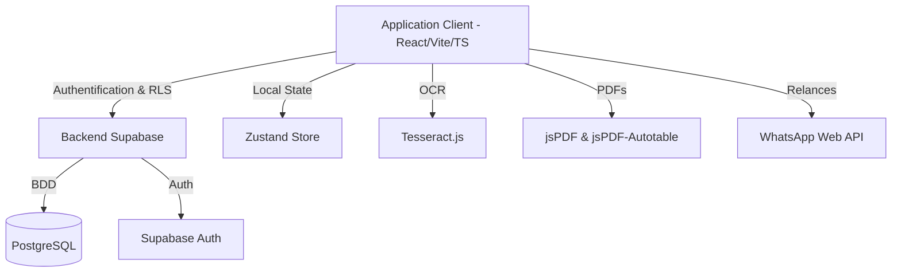
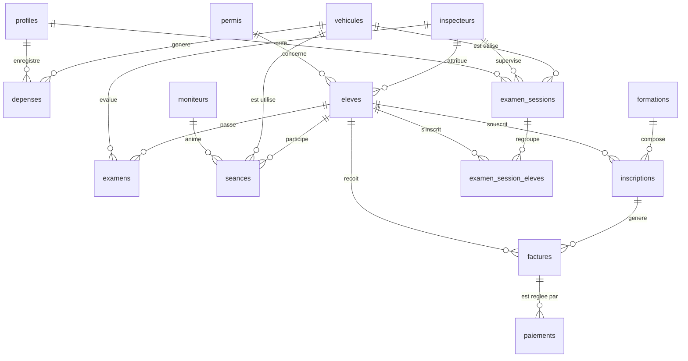

# Cahier des Charges — SARAH AUTO (ERP pour Auto-École)

Ce document présente les spécifications fonctionnelles, techniques et structurelles de l'application **SARAH AUTO**, une plateforme SaaS de gestion d'auto-école conçue pour moderniser et simplifier le pilotage administratif, pédagogique et financier d'un établissement d'apprentissage de la conduite.

---

## 1. Contexte & Objectifs du Projet

### Contexte
La gestion quotidienne d'une auto-école implique une coordination complexe entre l'inscription des élèves, la planification des heures de conduite avec différents moniteurs et véhicules, le suivi financier (facturation et encaissements), ainsi que la préparation des sessions d'examens officiels. **SARAH AUTO** répond à ce besoin en offrant un outil centralisé, moderne et collaboratif sous forme d'une plateforme SaaS.

### Objectifs Globaux
*   **Centralisation des Données** : Fédérer les élèves, les moniteurs, les véhicules, les plannings, les examens et la comptabilité sur une interface unique.
*   **Expérience Client Améliorée** : Offrir un portail dédié aux élèves pour suivre leur progression, consulter leur planning et télécharger leurs reçus financiers.
*   **Automatisation & Gain de Temps** : Intégrer des technologies modernes comme la reconnaissance de pièces d'identité (OCR) pour accélérer l'inscription des élèves et la génération de relances via WhatsApp.
*   **Sécurité et Droits d'Accès** : Mettre en œuvre un contrôle d'accès granulaire basé sur les rôles (Row Level Security - RLS) pour protéger les données sensibles.

---

## 2. Spécifications Techniques & Architecture

L'application repose sur une stack moderne, robuste et performante, conçue pour minimiser les coûts d'infrastructure tout en assurant une haute réactivité.



### Stack Technique
*   **Framework Frontend** : [TanStack Start](https://tanstack.com/router/v1) (basé sur React, Vite, TypeScript) utilisant le routage basé sur les fichiers pour une navigation fluide et des performances optimales.
*   **Base de Données & Backend** : [Supabase](https://supabase.com/) (PostgreSQL) gérant l'authentification des utilisateurs, le stockage relationnel et la sécurité des données via le mécanisme de RLS (Row Level Security).
*   **Gestion d'État (State Management)** : [Zustand](https://github.com/pmndrs/zustand) pour la gestion locale réactive et la synchronisation en temps réel avec Supabase.
*   **Styling & UI** : [Tailwind CSS v4](https://tailwindcss.com/) pour le style, combiné avec les composants [Radix UI](https://www.radix-ui.com/) et [shadcn/ui](https://ui.shadcn.com/) pour une interface élégante et responsive.
*   **Intelligence Artificielle & OCR** : [Tesseract.js](https://tesseract.projectnaptha.com/) pour l'extraction de texte (OCR) depuis la webcam afin de scanner automatiquement les Cartes Nationales d'Identité (CNI).
*   **Génération de Documents** : [jsPDF](https://github.com/parallax/jsPDF) et [jsPDF-AutoTable](https://github.com/simonbengtsson/jsPDF-AutoTable) pour la création dynamique de reçus, factures et bordereaux d'examen au format PDF.

---

## 3. Modèle de Données (Base de Données Supabase)

Le schéma relationnel PostgreSQL sous-jacent est conçu pour assurer l'intégrité référentielle et historique des données.



### Liste des Tables
1.  **`profiles`** : Profils de l'équipe de l'auto-école.
    *   `id` (UUID, FK auth.users) : Clé primaire.
    *   `email` (Text, Unique) : Adresse email.
    *   `name` (Text) : Nom complet.
    *   `role` (Text Check) : Rôle dans l'application (`administrateur_principal`, `administrateur_secondaire`, `comptable`, `moniteur`, `conseiller`).
2.  **`permis`** : Types de permis disponibles.
    *   `id` (UUID) : Clé primaire.
    *   `code` (Text, Unique) : Code court (ex: `A`, `B`, `AB`).
    *   `libelle` (Text) : Description du permis (ex: `Moto`, `Voiture`).
3.  **`inspecteurs`** : Liste des inspecteurs officiels d'examen.
    *   `id` (UUID) : Clé primaire.
    *   `nom`, `prenom` (Text) : Identité.
    *   `telephone`, `email` (Text) : Coordonnées.
    *   `actif` (Boolean) : Statut de l'inspecteur.
4.  **`moniteurs`** : Équipe pédagogique (moniteurs de conduite).
    *   `id` (UUID) : Clé primaire.
    *   `nom`, `prenom` (Text) : Identité.
    *   `telephone` (Text) : Téléphone (obligatoire pour relances).
    *   `email` (Text) : Email.
    *   `specialite` (Text) : Spécialité de formation (ex: Code, Conduite).
    *   `statut` (Text) : Disponibilité (`Disponible`, `En mission`, `Absent`).
5.  **`vehicules`** : Parc automobile de l'auto-école.
    *   `id` (UUID) : Clé primaire.
    *   `marque`, `modele` (Text) : Détails du véhicule.
    *   `immatriculation` (Text, Unique) : Numéro d'immatriculation.
    *   `etat` (Text) : État de disponibilité (`Disponible`, `En maintenance`, `En panne`).
6.  **`eleves`** : Fichier central des apprenants.
    *   `id` (UUID) : Clé primaire.
    *   `nom`, `prenom` (Text) : Identité.
    *   `telephone` (Text) : Téléphone de l'élève (sert aussi d'identifiant portail).
    *   `email`, `adresse` (Text) : Coordonnées.
    *   `date_naissance` (Date), `lieu_naissance` (Text) : Informations de naissance.
    *   `sexe`, `nationalite` (Text) : Informations d'identité.
    *   `type_piece`, `num_piece` (Text) : Pièce d'identité présentée.
    *   `photo_cni`, `photo_profil` (Text Base64 / URL) : Justificatif et photo.
    *   `statut` (Text Check) : Statut dans le parcours (`prospect`, `inscrit`, `en_formation`, `examen`, `admis`, `ajourne`, `termine`, `abandon`).
    *   `code` / `dossier_code` (Text) : Code unique de dossier élève (sert d'identifiant de connexion pour le portail élève).
    *   `type_permis` (Text) : Catégorie de permis préparée.
    *   `est_parraine` (Boolean), `parrain_nom` (Text) : Suivi des parrainages.
    *   `date_inscription` (Date) : Date officielle d'entrée.
7.  **`formations`** : Catalogue d'offres commerciales.
    *   `id` (UUID) : Clé primaire.
    *   `nom` (Text) : Titre de la formation (ex: Pack Permis B standard).
    *   `description` (Text) : Contenu de la formation.
    *   `prix` (Numeric) : Tarif catalogue.
    *   `actif` (Boolean) : Statut de l'offre commerciale.
8.  **`inscriptions`** : Associations concrètes Élève <=> Formation.
    *   `id` (UUID) : Clé primaire.
    *   `eleve_id` (UUID, FK eleves) : Élève inscrit.
    *   `formation_id` (UUID, FK formations) : Formation choisie.
    *   `tarif` (Numeric) : Tarif réel appliqué (permet des remises personnalisées).
    *   `date_inscription` (Date) : Date de début d'inscription.
9.  **`examens`** : Historique individuel des épreuves de permis.
    *   `id` (UUID) : Clé primaire.
    *   `eleve_id` (UUID, FK eleves) : Candidat.
    *   `type_examen` (Text) : `Code` ou `Conduite`.
    *   `type_permis` (Text) : Type de permis visé.
    *   `date_examen` (Date) : Date de l'épreuve.
    *   `inspecteur` (Text) : Inspecteur ayant fait passer l'examen.
    *   `resultat` (Text Check) : Résultat de l'épreuve (`en_attente`, `admis`, `echec`).
    *   `notes` (Text) : Remarques ou observations.
10. **`examen_sessions`** & **`examen_session_eleves`** : Gestion des sessions groupées et des bordereaux officiels.
    *   Permet de planifier des sessions collectives d'examen (Code ou Conduite).
    *   `numero_bordereau` (Text, Unique) : Numéro officiel du bordereau.
    *   `examen_session_eleves` contient un instantané (snapshot) des données élèves (`nom_complet`, `identifiant`, `telephone`, `categorie_permis`) pour préserver l'intégrité historique même si le dossier élève est ultérieurement modifié ou supprimé.
11. **`seances`** : Séances de conduite ou cours théoriques (plannings).
    *   `id` (UUID) : Clé primaire.
    *   `eleve_id` (UUID, FK eleves) : Élève participant.
    *   `moniteur_id` (UUID, FK moniteurs) : Instructeur affecté.
    *   `vehicule_id` (UUID, FK vehicules) : Véhicule utilisé.
    *   `date_seance` (Date) : Date.
    *   `heure_debut`, `heure_fin` (Time) : Horaires.
    *   `duree_minutes` (Integer) : Durée de la leçon.
    *   `statut` (Text) : `planifie`, `effectue`, `absent_eleve`, `annule`.
    *   `notes` (Text) : Fiche de suivi pédagogique rédigée par le moniteur.
12. **`factures`** : Factures émises à destination des élèves.
    *   `id` (UUID) : Clé primaire.
    *   `numero` (Text, Unique) : Numéro séquentiel de facture.
    *   `eleve_id` (UUID, FK eleves) : Destinataire.
    *   `inscription_id` (UUID, FK inscriptions) : Inscription liée.
    *   `montant` (Numeric) : Total de la facture.
    *   `statut` (Text Check) : État (`non_payee`, `partielle`, `payee`, `impayee`).
    *   `date_emission` (Date) : Date d'émission.
13. **`paiements`** : Encaissements reçus pour régulariser les factures.
    *   `id` (UUID) : Clé primaire.
    *   `facture_id` (UUID, FK factures) : Facture associée.
    *   `eleve_id` (UUID, FK eleves) : Élève ayant payé.
    *   `montant` (Numeric) : Somme encaissée.
    *   `mode_paiement` (Text) : Canal utilisé (`especes`, `orange_money`, `wave`, `virement`).
    *   `reference` (Text) : Numéro de transaction Mobile Money ou bancaire.
    *   `date_paiement` (Date) : Date de réception des fonds.
14. **`depenses`** : Registre de comptabilité analytique (dépenses de l'auto-école).
    *   `id` (UUID) : Clé primaire.
    *   `categorie` (Text) : Nature de la dépense (`carburant`, `entretien`, `reparations`, `assurance`, `salaires`, `fournitures`, `autres`).
    *   `montant` (Numeric) : Somme déboursée.
    *   `description` (Text) : Libellé de la dépense.
    *   `mode_paiement` (Text) : Mode de règlement.
    *   `vehicule_id` (UUID, FK vehicules) : Véhicule associé (si carburant/entretien).
    *   `justificatif_url` (Text) : Lien ou fichier du reçu de paiement.
    *   `date_depense` (Date) : Date de la transaction.
15. **`audit_log`** : Journal d'audit pour la traçabilité des modifications.
    *   `id` (UUID) : Clé primaire.
    *   `action` (Text) : Opération effectuée (`INSERT`, `UPDATE`, `DELETE`).
    *   `entity` (Text) : Nom de la table modifiée.
    *   `entity_id` (UUID) : Identifiant de la ligne modifiée.
    *   `old_data`, `new_data` (JSONB) : Instantanés avant/après modification pour comparaison historique.

---

## 4. Spécifications Fonctionnelles (Module par Module)

L'ERP SARAH AUTO se divise en plusieurs modules interconnectés.

### 4.1 Authentification et Gestion des Rôles
L'application propose deux méthodes de connexion :
*   **Espace Administration/Personnel** : Authentification classique par Email + Mot de passe gérée par Supabase Auth.
*   **Portail Élève** : Connexion simplifiée sans mot de passe en saisissant le **Code Dossier** (ex: `EL-XXXX`) + le **Numéro de téléphone**.

> [!NOTE]
> Les politiques RLS de Supabase garantissent qu'un élève connecté au portail ne peut lire et modifier que ses propres données personnelles, son planning et ses factures, tandis que l'équipe administrative dispose d'un accès global ou restreint selon son rôle (ex: les comptables voient uniquement les dépenses, paiements et factures).

### 4.2 Tableau de Bord (Centre de Pilotage)
Le tableau de bord administrateur synthétise les indicateurs clés (KPIs) de l'auto-école en temps réel :
*   **Indicateurs financiers** : Chiffre d'affaires au comptant (XOF), total des dépenses, bénéfice net mensuel et cumulé, montant des factures en attente de recouvrement.
*   **Indicateurs opérationnels** : Nombre d'élèves inscrits, nouveaux élèves du mois, taux de réussite global aux examens de permis de conduire.
*   **Outil de relances rapides** : Une section dédiée affiche les factures impayées et permet d'envoyer un rappel de paiement pré-rempli directement par WhatsApp en un clic.

### 4.3 Registre des Élèves et Scanner CNI (OCR)
*   **Fiche Élève Complète** : Gestion du cycle de vie complet de l'élève (Prospect -> En formation -> Examen -> Admis).
*   **Technologie OCR de CNI** : Lors de la création d'un élève, l'administrateur peut utiliser la webcam de son ordinateur ou de son téléphone pour scanner la pièce d'identité (CNI) de l'élève.
    *   L'application extrait automatiquement par IA le **Nom**, le **Prénom** et la **Date de naissance** pour pré-remplir le formulaire d'inscription.
*   **Gestion des Parrainages** : Suivi des élèves parrainés par d'anciens candidats pour des offres de fidélisation.

### 4.4 Planning & Séances de Conduite
*   **Calendrier des cours** : Planification des séances de conduite (Cours, Examen, Rendez-vous) pour chaque binôme Élève/Moniteur.
*   **Attribution des Véhicules** : Permet de choisir et d'affecter un véhicule disponible pour éviter les doublons de réservation.
*   **Suivi Pédagogique** : À la fin de chaque séance, le moniteur peut enregistrer des notes et le statut de présence de l'élève (`effectue`, `absent_eleve`, `annule`).

### 4.5 Examens, Sessions collectives et Bordereaux d'Examen
*   **Planification Individuelle** : Suivi classique des passages d'examens théoriques (Code) ou pratiques (Conduite) pour chaque élève.
*   **Sessions Collectives (Bordereaux)** :
    *   Création de sessions d'examen avec date, heure, centre et type d'examen (Code/Conduite).
    *   Ajout en bloc d'élèves éligibles à la session d'examen.
    *   **Bordereau PDF** : Génération d'un document PDF standardisé contenant la liste des candidats, les détails de la session, l'inspecteur désigné et le véhicule de service. Ce bordereau est imprimable pour présentation le jour de l'examen.
    *   **Saisie des Résultats en Masse** : Saisie rapide des résultats d'examen (Admis, Échec, Note, Observations) pour l'ensemble des candidats de la session à la fin de la journée.

### 4.6 Facturation, Paiements et Comptabilité
*   **Génération de Facture** : Émission automatique d'une facture dès qu'un élève souscrit à une formation.
*   **Paiements Multi-canaux** : Enregistrement des versements des élèves en précisant le mode de paiement (Wave, Orange Money, Espèces, Virement) et le numéro de référence.
*   **Calcul Automatique du Solde** : Calcule en temps réel le montant total payé et met à jour le statut de la facture (`payee`, `partielle` ou `non_payee`).
*   **Comptabilité Analytique (Dépenses)** : Enregistrement de tous les frais opérationnels de l'auto-école classés par catégorie (carburant, réparations mécaniques, primes d'assurance, salaires, achats de fournitures) avec possibilité de joindre une photo du reçu de paiement (justificatif).

### 4.7 Portail Élève ("Mon Espace")
Un espace sécurisé et simplifié conçu spécifiquement pour le téléphone mobile ou le navigateur de l'élève :
*   **Tableau de Bord Personnel** : Résumé des leçons programmées et statut du compte.
*   **Mon Planning** : Affichage des séances de conduite passées et futures, avec le nom du moniteur affecté, le véhicule utilisé et le lieu de rendez-vous.
*   **Mes Factures & Reçus** : Historique des factures d'inscription et des paiements versés. L'élève peut télécharger ses reçus de paiement et ses factures au format PDF à tout moment.
*   **Profil Personnel** : Mise à jour directe de sa photo de profil depuis son téléphone pour la fiche de l'auto-école.

---

## 5. Guide d'Installation & Déploiement

### Prérequis
*   **Node.js** : Version `22.x` ou ultérieure.
*   **Base de données** : Une instance de projet active sur **Supabase**.

### Variables d'Environnement
Créer un fichier `.env` à la racine du projet avec les variables suivantes :
```env
VITE_SUPABASE_URL=https://votre-projet.supabase.co
VITE_SUPABASE_ANON_KEY=votre-cle-anonyme-supabase
```

### Installation Initiale
1.  **Cloner le dépôt et installer les dépendances** :
    ```bash
    npm install
    ```
2.  **Lancer le serveur de développement local** :
    ```bash
    npm run dev
    ```
    L'application sera accessible localement à l'adresse `http://localhost:3000`.

3.  **Appliquer les migrations de base de données** :
    Se connecter à l'interface en ligne de commande de Supabase ou exécuter le code SQL contenu dans le répertoire `/supabase/migrations/` dans l'éditeur SQL de votre console Supabase (dans l'ordre séquentiel des fichiers).

### Déploiement Production
1.  **Générer le livrable de production** :
    ```bash
    npm run build
    ```
2.  **Hébergement** :
    L'application est configurée pour être déployée de manière optimale sur des plateformes comme **Vercel** ou **Netlify** grâce aux configurations de routage dynamique de TanStack Start.
